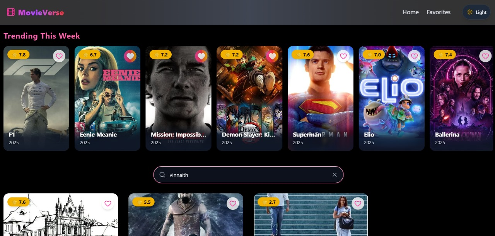
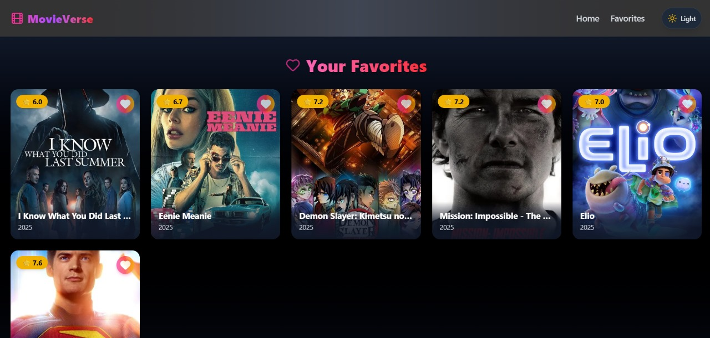
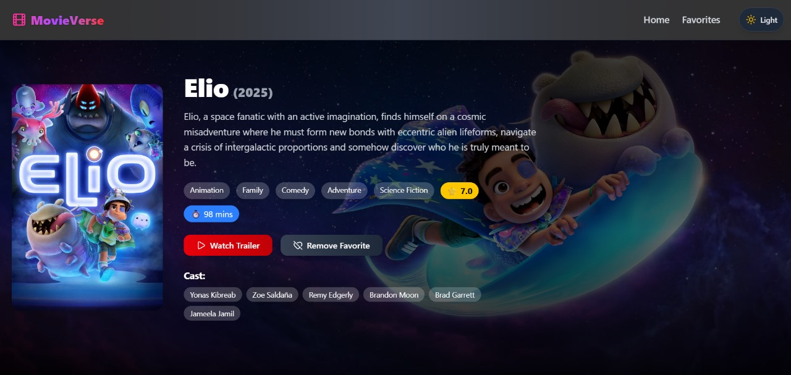

# 🎬 MovieVerse

MovieVerse is a modern movie exploration platform.  
It allows users to search, browse, and discover trending movies with a sleek UI built in React.js.

## 🚀 Features
- Smart Search with debounce functionality
- Browse trending movies
- Dark & Light mode support
- Fully responsive design
- Optimized performance with Redux Toolkit
- Modern UI with Tailwind CSS

## 🛠️ Tech Stack
- **Frontend:** React.js, Vite
- **State Management:** Redux Toolkit
- **Styling:** Tailwind CSS, Lucide Icons
- **API:** [TMDB API](https://www.themoviedb.org/documentation/api)

## 📸 Screenshots




## Assumptions & Limitations
- The project assumes the user has a stable internet connection to fetch movie data from the TMDB API
- Only the English language movies are displayed; multi-language support is not implemented.
- Movie data depends entirely on the TMDB API; if the API is down or rate-limited, some features may not work.
- Favorites are stored locally in the browser (e.g., localStorage); there is no backend persistence.
- Dark/Light mode preferences are stored locally and will not sync across devices.
Some edge cases like duplicate movie IDs may not be handled in the UI.


Clone the repository:
```bash
git clone "https://github.com/vikram-G191/MovieVerse.git" 
cd movieverse
```

Install dependencies:
```bash
npm install 
```

Run the project locally:
```bash
npm run dev
